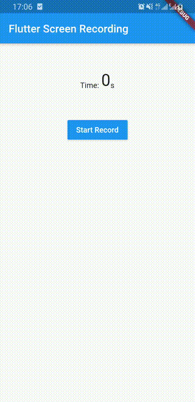

# flutter_screen_recording



A new Flutter plugin for record the screen. This plug-in requires Android SDK 21+ and iOS 10+


## Getting Started

This plugin can be used for record the screen on Android and iOS devices.

1) For start the recording

```dart
bool started = FlutterScreenRecording.startRecordScreen(videoName);
```
Or

```dart
bool started = FlutterScreenRecording.startRecordScreenAndAudio(videoName);
```

2) For stop the recording

```dart
String path = FlutterScreenRecording.stopRecordScreen;
```

## iOS

You only need add the permission message on the Info.plist 

	<key>NSPhotoLibraryUsageDescription</key>
	<string>Save video in gallery</string>
	<key>NSMicrophoneUsageDescription</key>
	<string>Save audio in video</string>
